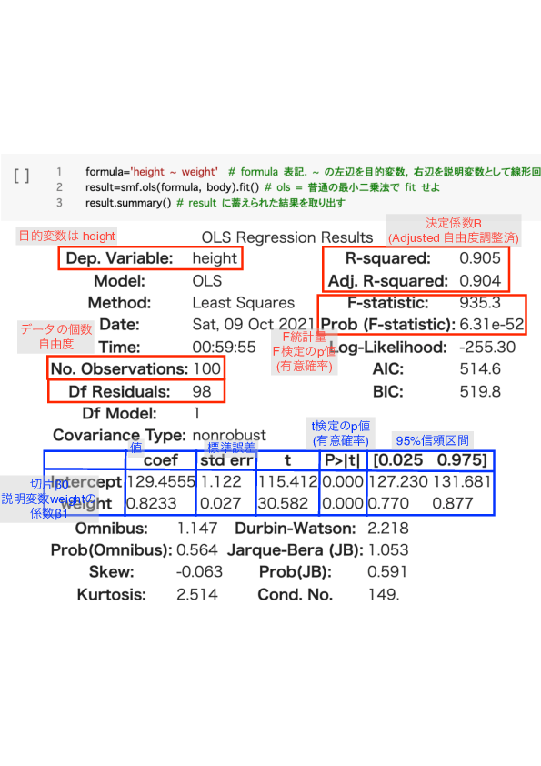

# E02

## E02_01
[説明関数の呼び出し方.md](../doc/説明関数の呼び出し方.md) を読んで，Python の関数の呼び方を理解してください．

### 今日使う関数
- sklearn.linear_model.LinearRegression https://scikit-learn.org/stable/modules/generated/sklearn.linear_model.LinearRegression.html
  - コンストラクタ LinearRegression(), メソッドfit(), predict(), score() などを持つ．
  - X: 説明変数の行列
  - y: 目的変数のベクトル
- statmodels
  - キーワード引数 endog: 目的変数
  - キーワード引数 exog: 説明変数
  - コンストラクタ ols() statmodels.api.OLS https://www.statsmodels.org/stable/generated/statsmodels.formula.api.ols.html,
  - メソッドfit(), predict(), summary() などを持つ．https://www.statsmodels.org/stable/generated/statsmodels.regression.linear_model.OLS.html

### よく出てくる関数名
- メソッド`fit()`は，与えられたデータから母数を推定します．
- メソッド`predict()`は，推定された母数を使って，説明変数から目的変数の値を計算します（予測します）．

## E02_02
- 提出：2026-10-14水13:30まで
- Moodleに`.ipynb`ファイルをアップロード
- [mva_2026_E02_02_multiple_linear_regression.ipynb](mva_2026_E02_02_multiple_linear_regression.ipynb) を実行して，scikit-learn の LinearRegression による重回帰分析の方法を理解してください．

## E02_03
- 提出：2026-10-14水13:30まで
- Moodleに`.ipynb`ファイルをアップロード
- [mva_2026_E02_03_multiple_linear_regression.ipynb](mva_2026_E02_03_multiple_linear_regression.ipynb) を実行して，
statsmodels の OLS による重回帰分析の方法を理解してください．

OLSのfit()の結果の解釈は，次の図を参考にしてください．

